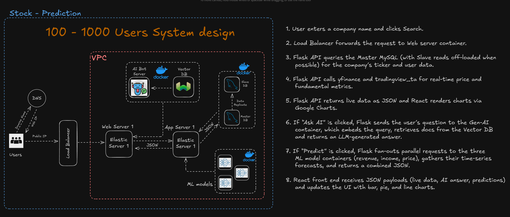
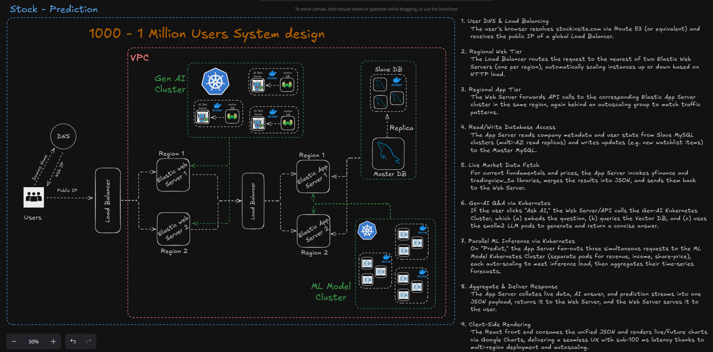
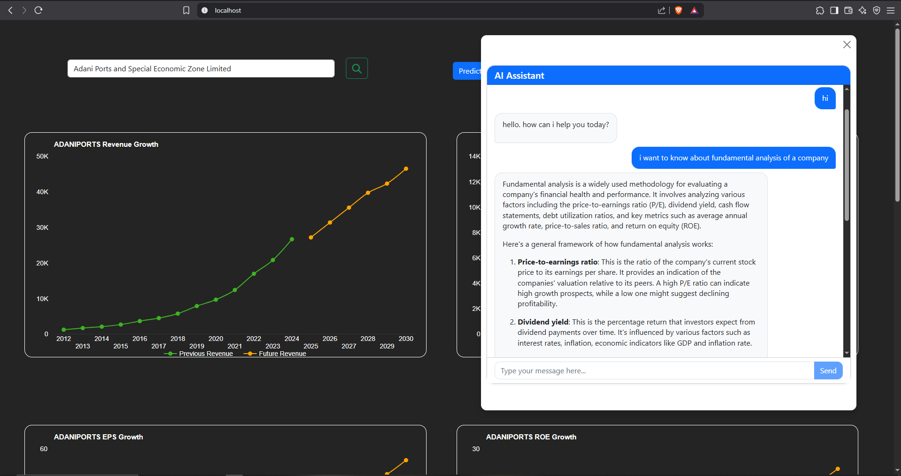
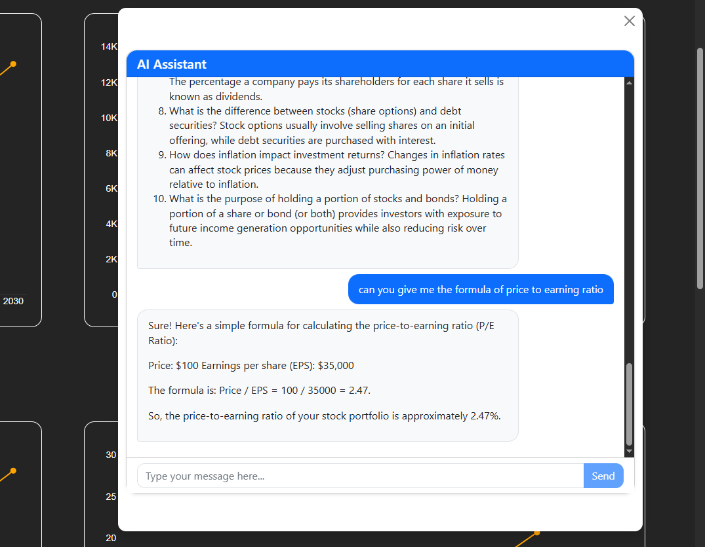
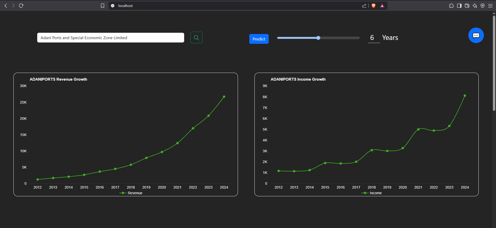
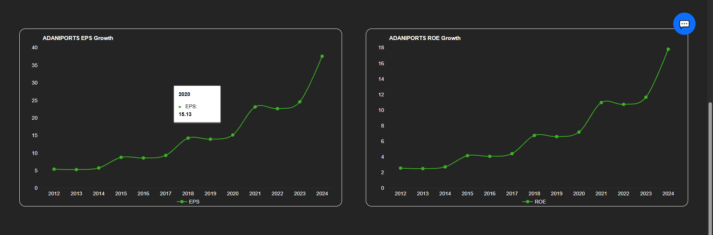
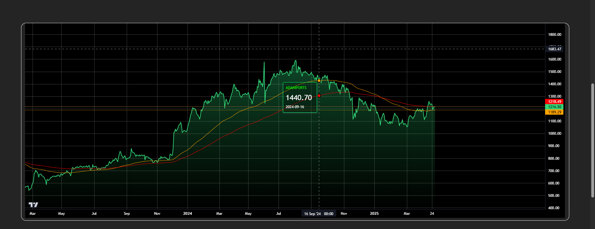
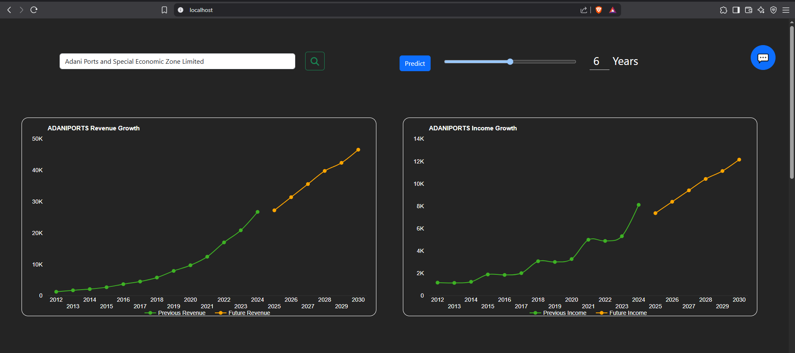
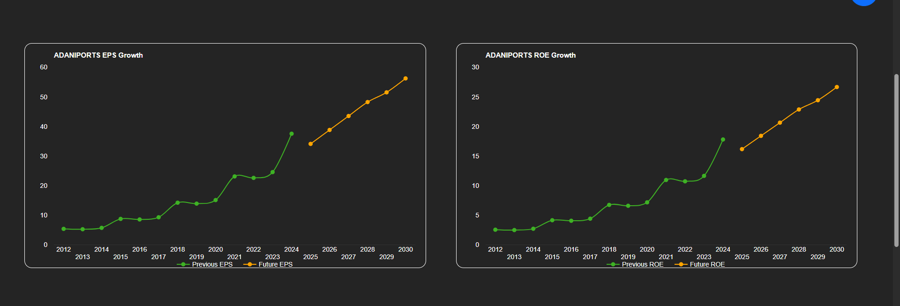
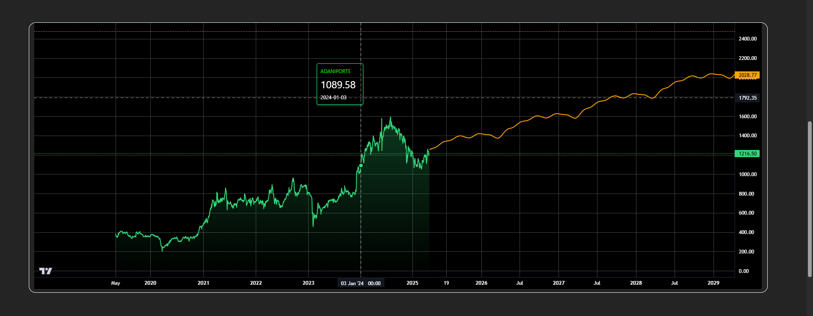

# StockPredictor

## Overview
StockPredictor is a containerized, microservices-based web application that provides:
- Real-time stock data and technical indicators (via yfinance & TradingView-TA)
- Future share price, revenue, and income predictions (via three separate ML models)
- Natural language Q&A on stock market topics (via a smollm2 LLM)
- Interactive visualizations using Google Charts

## Architecture
- **Frontend:** React app served from AWS S3 + CloudFront
- **API Layer:** Flask microservices behind API Gateway & ALB
- **Containers:** Deployed on Amazon ECS Fargate
  - `mysql:8.0` for RDS-compatible data storage
  - `backend-flask` for business logic & data ingestion
  - `frontend-node` (React SSR or static)
  - `model-price`, `model-revenue`, `model-income` for ML predictions
  - `genai-llm` for LLM Q&A
- **Database:** Amazon RDS for MySQL (Master + Read Replica)
- **Inference:** Amazon SageMaker real-time endpoints (auto-scaling)
- **Caching:** Amazon ElastiCache Redis
- **CDN:** Amazon CloudFront
- **Monitoring:** CloudWatch Metrics, AWS X-Ray, AWS WAF

## Procedure to get the project into local

## step 1 :-

  Prechecks :-
  This project usning some port for the app communication so the mentioned ports should be free

  * frontend docker running on port   = 80
  * backend running on port           = 81
  * database docker running on port   = 82
  * ollama docker runing on port      = 83

  ```bash
  netstat -ano | findstr :80
  netstat -ano | findstr :81
  netstat -ano | findstr :82
  netstat -ano | findstr :83
  ```

  install the docker desktop and Python 3.9.13 as per your os
  https://www.docker.com/products/docker-desktop/

  install Python 3.9.13
  https://www.python.org/downloads/release/python-3913/


## step 2 :-
  select the folder where you need to fetch the project and run below command
  ```bash
 git clone https://github.com/Aravind8967/Stock-Prediction.git
 cd Stock-Prediction
 ```

## step 3 :-
  Start the docker desktop belfore running the project

## step 4 :-
  To start the project run below command in git bash
  ```bash
  # Note :- Before running the StartProject.sh docker desktop should be running 
  #         other wise script won't work 
  ./StartProject.sh

  # To stop the project
  ./StopProject.sh
  ```

## step 5 :-
  open your favourite Browser and search for

  http://localhost:80/

# System design Images





# Project images
















